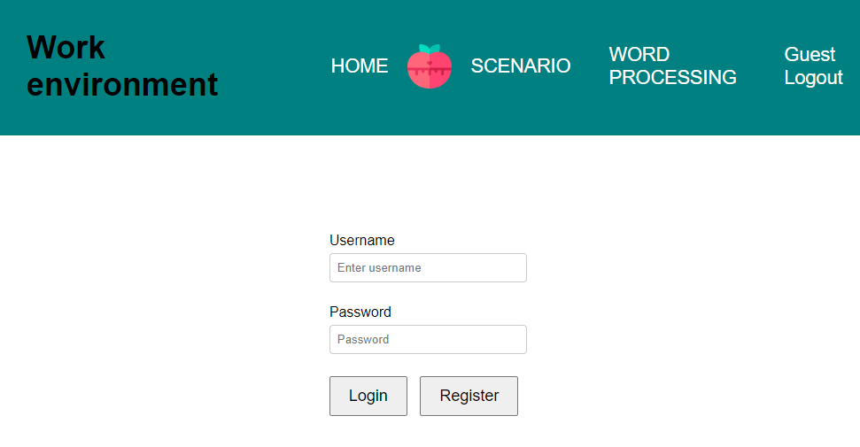
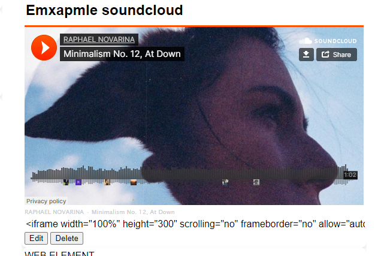
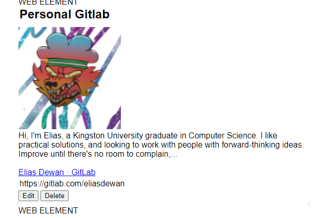
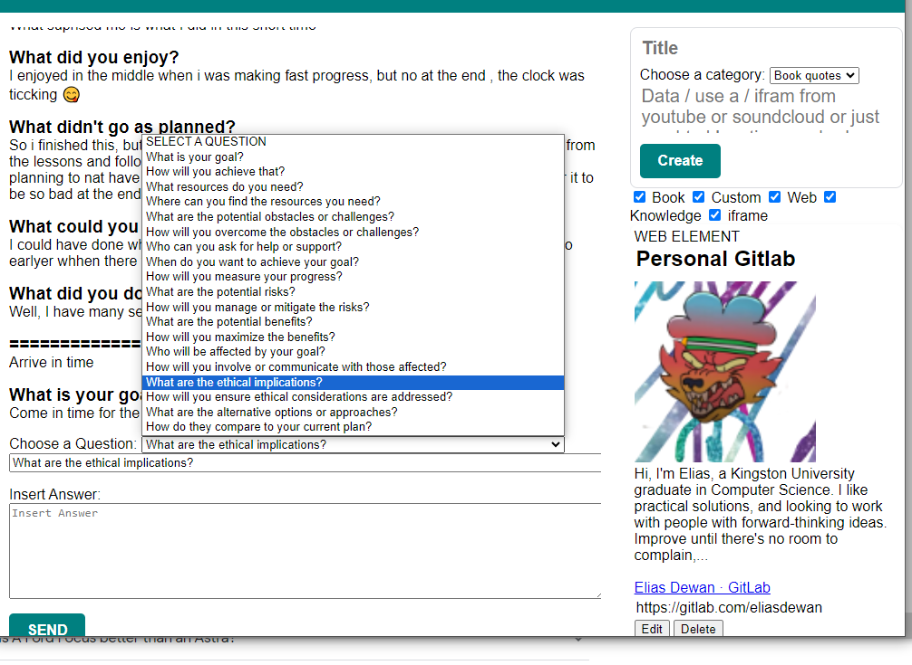

# PHP-Productivity-Notes-website
Final year project repository Create tasks, with rich WYSIWYG using TinyMCE document format With website summary api 

Published on **[kunet.kingston.ac.uk/k2056101](kunet.kingston.ac.uk/k2056101)**

## Homepage

## Login Screen

## iFrame exaple
### Ian iframe link was added and a window appears instead of a note

## Website summary
### A url link of a webpage was given and it genarates a summary with picture of tha url

## Login Screen
### A page for self reflection with notes panel available at the side.
#### Select a question or write down your own question and aswer it. A self reflection excercise.

